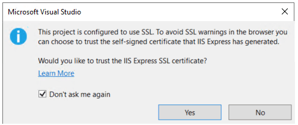
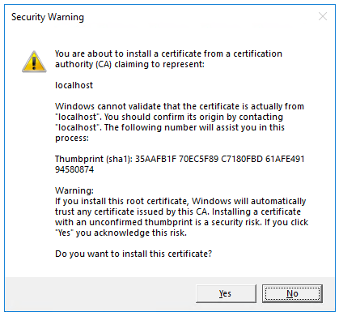

# WebAPI primer

---

# Uvod u .NET

.NET je open-source platforma koja služi za kreiranje aplikacija raznih namena poput konzolnih, web i desktop aplikacija. Moze pokrenuti programe napisane u raznim programskim jezicima - C# je najzastupljeniji. 

.NET platforma omogućava produktivnost, performanse, sigurnost i pouzdanost.

# Preduslovi

### .NET SDK

1. Skinuti .NET SDK sa [zvaničnog sajta](https://dotnet.microsoft.com/en-us/download)
2. Pokrenuti instalaciju i ispratiti korake sa prethodnog linka

### Visual Studio

1. Instalirati [Visual Studio 2022 Preview](https://visualstudio.microsoft.com/vs/preview/#download-preview) sa ASP\.NET and web development

# Kreairanje WebAPI projekta

- Iz **File** menija, izabrati **New** > **Project**
- Uneti **Web API** u search box
- Izabrati **ASP\.NET Core Web API** template i pritisnuti **Next**
- Uneti ime projekta u polju **Project name** i pritisnuti **Next**
- Za Framework izabrati **.NET 8.0 (Long Term Support)**
- Pritisnuti **Create**

### Dodavanje NuGet paketa

NuGet predstavlja sistem za upravljanje paketima unutar .NET platforme. Koristi se kako bi se lako povezale gotove biblioteke sa projektom.

Za ovaj primer potrebno je instalirati NuGet paket kako bi se aplikacija povezala sa bazom podataka.

- Izabreati **Tools** meni, zatim pritisnuti **NuGet Package Manager** > **Manage NuGet Packages for Solution**.
- Pritisnuti **Browse**
- Uneti **Microsoft.EntityFrameworkCore.InMemory** u search box i zatim izabrati `Microsoft.EntityFrameworkCore.InMemory`.
- Izabrati **Project** i pritisnuti na **Install**.


# Pokretanje WebAPI projekta

Za pokretanje projekta bez debuggera pritisnuti **Ctrl+F5**.

Visual Studio ce prikazati sledeće prozore prilikom prvog pokretanja projekta:

Izabrati **Yes**.

Nakon toga iskočiće sledeći prozor. Potrebno je pritisnuti **Yes**.


Visual Studio ce pokrenuti podrazumevani web pretrazivač i otvoriti stranicu `https://localhost:<port>/swagger/index.html` gde je `<port>` nasumičan izabrani port broj generisan prilikom pravljena projekta.

# Testiranje API

Odlaskom na sledeću stranicu: `https://localhost:<port>/swagger/index.html` gde je `<port>` port web servera, mozete testirati API pozive.

Izabrati API za testiranje i nakon toga pritisnuti dugme **Try it out** > **Execute**.

Stranica prikazuje sledeće:
- Curl komandu za za testiranje izabranog API
- URL za testiranje API
- Response code, body i headers
- Drop-down listu za izbog tipa kao i primer i šemu

# Dodavanje model klase

Model klasa predstavlja reprezentaciju nekog podatka koji se koristi u okviru projekta.

- U **Solution Explorer** pritisnuti desni klik. Izabrati **Add** > **New Folder** i nazvati ga `Models`.
- Pritisnuti desni klik na folderu `Models` i zatim izabrati **Add** > **Class**, nazvati ga `TodoItem` i pritisnuti **Add**.
- Prekopirati sledeći kod:
    ```C#
    namespace TodoApi.Models;

    public class TodoItem
    {
        public long Id { get; set; }
        public string? Name { get; set; }
        public bool IsComplete { get; set; }
    }
    ```

# Dodavanje database context-a

Database context je glavna klasa koja upravlja Entity Framework funkcionlanostima za data model. Ova klasa nasledjuje klasu Microsoft.EntityFrameworkCore.DbContext.

- Pritisnuti desni klik na folder `Models` i izabrati **Add** > **Class**. Nazvati klasu `TodoContext` i pritisnuti **Add**.
- Uneti sledeći kod:
    ```C#
    using Microsoft.EntityFrameworkCore;

    namespace TodoApi.Models;

    public class TodoContext : DbContext
    {
        public TodoContext(DbContextOptions<TodoContext> options)
            : base(options)
        {
        }

        public DbSet<TodoItem> TodoItems { get; set; } = null!;
    }
    ```

# Registrovanje database context-a

Servis DBContext mora biti registrovan putem dependency injection-a.

Potrebno je dodati sledeći kod u fajlu `Program.cs`:
```C#
using Microsoft.EntityFrameworkCore;
using TodoApi.Models;
```

```C#
...
builder.Services.AddDbContext<TodoContext>(opt =>
opt.UseInMemoryDatabase("TodoList"));
...
```

# Kreiranje kontrolera

- Desni klik na `Controllers` folder.
- Izabrati **Add** > **New Scaffolded Item**.
- Izabrati **API Controller with actions, using Entity Framework** i zatim pritisnuti **Add**.
- U dijalogu **Add API Controller with actions, using Entity Framework**:
    - Izabrati `TodoItem` (TodoApi.Models) u **Model class**.
    - Izabrati `TodoContext` (TodoApi.Models) u **Data context class**.
    - Pritisnuti **Add**.

Klasa ce biti obeležena sa atributom [ApiController] koji označava da kontroler reaguje na web API pozive.

# Rutiranje i URL putanje

Atribut [HttpGet] označava metod koji reaguje na `HTTP GET` pozive. URL putanja za svaki metod se označava na sledeći način:

```C#
[Route("api/[controller]")]
[ApiController]
public class TodoItemsController : ControllerBase
```

- Zameniti `[controller]` sa imenom kontrolera, primer: `[Route("api/TodoItems")]`

U metodi `GetTodoItem`, `{id}` predstavlja placeholder za dati atribut. Kada je `GetTodoItem` API pozvan, vrednost `{id}` biće prosledjen parametru `id`.

```C#
[HttpGet("{id}")]
public async Task<ActionResult<TodoItem>> GetTodoItem(long id)
{
    var todoItem = await _context.TodoItems.FindAsync(id);

    if (todoItem == null)
    {
        return NotFound();
    }

    return todoItem;
}
```

# Resursi:

1. https://learn.microsoft.com/en-us/dotnet/core/introduction?WT.mc_id=dotnet-35129-website
2. https://learn.microsoft.com/en-us/aspnet/core/tutorials/first-web-api?view=aspnetcore-8.0&tabs=visual-studio#scaffold-a-controller