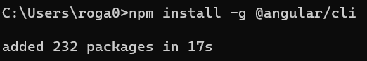
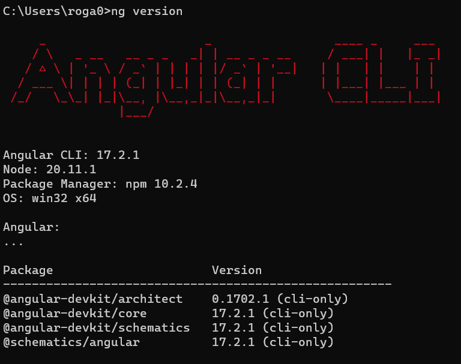
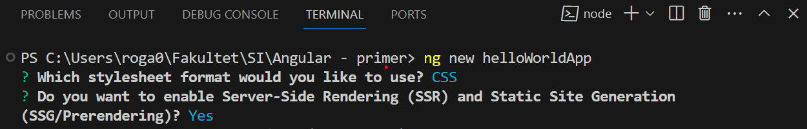
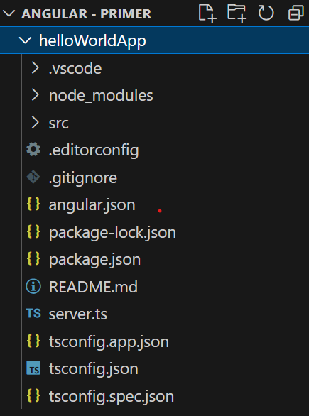
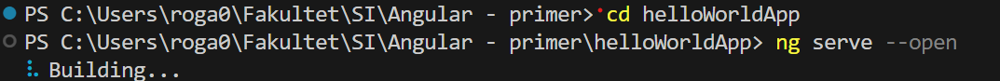
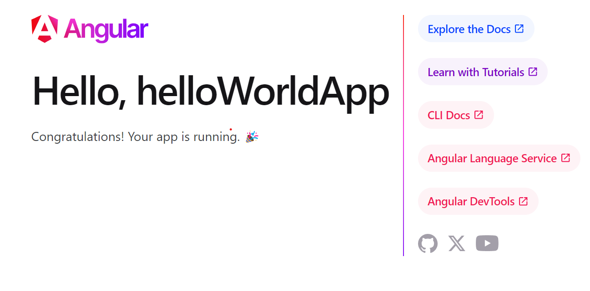



  

# Sadržaj

[UVOD U ANGULAR	2](#_toc159885896)

[TypeScript	2](#_toc159885897)

[Struktura	2](#_toc159885898)

[Karakteristike angulara	3](#_toc159885899)

[INSTALACIJA ANGULAR ALATA	4](#_toc159885900)

[NodeJS	4](#_toc159885901)

[Angular	4](#_toc159885902)

[RESURSI I KORISNI LINKOVI	7](#_toc159885903)

 
UVOD U ANGULAR
  

***Angular*** je open-source *JavaScript framework* koji je razvila kompanija *Google* i koristi se za kreiranje dinamičnih veb aplikacija. Široko se koristi za izradu jednostraničnih aplikacija (*SPAs*) i kompleksnih veb aplikacija. Angular koristi deklarativne *templates*, ubacivanje zavisnosti (dependency injections), alate za kreiranje *end-to-end* testiranja i integrisane najbolje prakse kako bi pojednostavio process razvoja i testiranja web aplikacija.

 
TypeScript
  

***TypeScript*** je sintaktični nadskup *JavaScript*-a koji dodaje statičko tipiziranje. To znači da *TypeScript* dodaje sintaksu iznad *JavaScript*-a, omogućavajući programerima da dodaju tipove.  U *JavaScript*-u, parametri funkcija i promenljive nemaju informacije. Zato programeri moraju da pogledaju dokumentaciju ili da nagađaju na osnovu implementacije. *TypeScript* omogućava specificiranje tipova podataka koji se koriste u kodu i ima sposobnost da prijavi greške kada tipovi ne odgovaraju.

Na primer, *TypeScript* će prijaviti grešku kada se proslešuje string funkciji koja očekuje broj. *JavaScript* to neće uraditi.

  
Struktura
  

Struktura *Angular*-a obuhvata nekoliko ključnih elemenata koji omogućavaju organizaciju, razvoj i funkcionalnost veb aplikacija, uključujući module, komponente, servise, direktive i rute:

- **Moduli (*Modules*)**: *Angular* aplikacija je organizovana u module. Moduli grupišu komponente, direktive, servise i druge *Angular* funkcije koje imaju srodnu funkcionalnost. Glavni modul se naziva *AppModule*.

- **Komponente (*Components*)**: *Komponente* predstavljaju osnovne gradivne blokove *Angular* aplikacije. Svaka komponenta sastoji se od HTML predloška (*template*-a) koji definiše korisnički interfejs, *TypeScript* klase koja definiše logiku komponente, i *CSS* stila koji definiše izgled komponente.

- **Servisi (*Services*):** *Servisi* su singleton objekti koji obavljaju specifične zadatke i mogu biti deljeni između različitih delova aplikacije. Oni se obično koriste za upravljanje podacima, poslovnim logikom, ili integracijom sa serverom. 

  U *Angular* aplikaciji, servisi (*services*) imaju najviše povezanosti sa *back*-endom. Servisi se često koriste za komunikaciju sa serverom, slanje *HTTP* zahteva, dobijanje podataka sa servera, i upravljanje logikom aplikacije koja je vezana za podatke. Ovo omogućava razdvajanje poslovnog sloja aplikacije od korisničkog interfejsa, što olakšava održavanje i proširivanje aplikacije. Dok komponente uglavnom služe za prikazivanje podataka i interakciju sa korisnikom, servisi omogućavaju *Angular* aplikaciji da komunicira sa back-endom i manipuliše podacima.

- **Direktive (*Directives*)**: *Angular* direktive su specijalne oznake koje se primenjuju na *HTML* elemente kako bi promenile njihovo ponašanje ili izgled. Postoje dve vrste direktiva: strukturne (koje menjaju strukturu *DOM*-a) i atributne (koje menjaju izgled ili ponašanje postojećih elemenata).

- **Rute (*Routes*):** *Angular* pruža rute za navigaciju unutar aplikacije. Rute definišu *URL* putanje i povezuju ih sa odgovarajućim komponentama. Ovo omogućava da se aplikacija ponaša kao jednostranična (*SPA*), gde se sadržaj menja dinamički bez potrebe za ponovnim učitavanjem cele stranice.

 
Karakteristike angulara
  

*Angular* je moćan framework za razvoj web aplikacija koji se ističe po svojoj modularnosti, reaktivnom pristupu i bogatom ekosistemu alata i funkcionalnosti.

- **Kreiran za *SPA* (*Single Page Applications*)**: *Angular* je posebno dizajniran za razvoj jednostraničnih aplikacija (*SPA*) koje omogućavaju brzo učitavanje i interaktivnost bez potrebe za ponovnim učitavanjem cele stranice.

- **Komponentna arhitektura**: *Angular* se zasniva na komponentnoj arhitekturi, gde se aplikacija gradi od nezavisnih komponenti koje imaju svoj *HTML* predložak, *TypeScript* kod i *CSS* stilove.

- **Deklarativno programiranje**: *Angular* koristi deklarativni stil programiranja, što znači da se fokusira na opisivanje "šta" se želi postići umesto "kako" to postići. Ovo olakšava razumevanje koda i smanjuje mogućnost grešaka.

- **Dependency Injection (*Ubacivanje zavisnosti*)**: *Angular* koristi mehanizam ubacivanja zavisnosti koji omogućava efikasno upravljanje zavisnostima između različitih delova aplikacije, čime se olakšava testiranje i održavanje.

- **Routing**: *Angular* pruža moćan sistem rutiranja koji omogućava navigaciju između različitih delova aplikacije bez potrebe za ponovnim učitavanjem cele stranice.
- **Observable pattern**: *Angular* koristi *RxJS* biblioteku za upravljanje asinhronim događajima koristeći Observable pattern, što omogućava lakše upravljanje asinhronim operacijama kao što su HTTP zahtevi ili korisnički interfejsni događaji.

- **Testiranje**: *Angular* ima ugrađenu podršku za testiranje, uključujući unit testove, integraciono testiranje i *E2E* (*end-to-end*) testiranje, što olakšava održavanje visokog kvaliteta koda.

  
INSTALACIJA ANGULAR ALATA
  

*Angular* se može razvijati koristeći različite *IDE*-ove poput *Visual Studio Code*-a, *WebStorm*-a i *Sublime* *Text*-a. U ovom slučaju, koristiće se *Visual Studio Code*, besplatni i open-source editor koda koji je razvila kompanija *Microsoft*.

 
NodeJS
  

Da biste započeli sa *Angularom*, potrebno je instalirati *Node.js* i *npm*, koji je upravljač paketima za *Node.js*. *Node.js* se može preuzeti sa zvanične veb stranice <https://nodejs.org/en/> i instalirati računar. Preporučuje se korišćenje *LTS* (*Long-Term Support*) verzije *Node.js*-a. 

 
Angular
  

Kada je *Node*.js instaliran, otvoriti ***command prompt*** ili terminal i pokrenuti komandu ***npm install -g @angular/cli*** kako bi se instalirao *Angular* *CLI* globalno:

  1 *komanda za instalaciju angular-a*

Poruka “*added 232 packages*” znači da su svi potrebni paketi instalirani i *Angular CLI* je spreman za korišćenje.
##
**Napomena:**  Potrebno je dodati dve putanje u sistemsku putanju (*PATH*) na računaru:

1. C:\Program Files\nodejs\C:\Program Files\nodejs\ - podrazumevani direktorijum gde se instalira Node.js.

1. C:\Users\naziv\_korisnika\AppData\Roaming\npm - mesto gde Node Package Menager smešta globalno instalirane npm pakete (u ovom slučaju - angular).

Dodavanjem ovih putanja u **sistemsku putanju** (*PATH*) se omogućava pristup instaliranim alatima (kao što su *Node.js* i *npm*) iz bilo kog direktorijuma u kom se nalazite u komandnoj liniji ili terminalu, bez potrebe za navođenjem punih putanja do izvršnih datoteka. Pokretanjem komande ng version može se proveriti da li je sve uspešno instalirano.

  2 *uspešna instalacija Angulara*

Nakon što je instalacija završena, može se kreirati novi *Angular* projekat pokretanjem komande ***ng new naziv\_aplikacije*** u terminalu foldera gde želite čuvati aplikaciju:

  3 *komanda za kreiranje Angular aplikacije*

`	`*SSR* i *SSG* su tehnike koje se koriste za generisanje *HTML*-a na serverskoj strani, što može biti korisno za poboljšanje performansi i *SEO* (*Search Engine Optimization*) veb aplikacije. U jednostavnom primeru kao što je ovaj, ove tehnike nisu neophodne. Nakon kreiranja aplikacije okruženje izgleda ovako:

 
  4 *novokreirana aplikacija*

Pokretanje aplikacije se izvršava tako što je potrebno nalaziti se unutar foldera aplikacije, kojoj se može pristupiti komandom ***cd helloWorldApp***. Ona se pokreće uz komandu ***ng serve –open***, koja će pokrenuti Angular razvojni server i otvoriti aplikaciju u podrazumevanom web pregledaču.

  5 *pokretanje aplikacije*

  6 *pokrenuta helloWorldApp*

  
RESURSI I KORISNI LINKOVI
 

- [*https://www.youtube.com/watch?v=JWhRMyyF7nc&t=456s&ab_channel=EnvatoTuts%2B*](https://www.youtube.com/watch?v=JWhRMyyF7nc&t=456s&ab_channel=EnvatoTuts%2B)
- [*https://angular.io/guide/architecture*](https://angular.io/guide/architecture)
- [*https://designtechworld.medium.com/chapter-1-introduction-to-angular-c336fecc2ad8*](https://designtechworld.medium.com/chapter-1-introduction-to-angular-c336fecc2ad8)
- [*https://medium.com/technology-hits/10-best-angular-libraries-for-2023-fcac69f6e962*](https://medium.com/technology-hits/10-best-angular-libraries-for-2023-fcac69f6e962)
- [*https://angular.io/guide/understanding-angular-overview*](https://angular.io/guide/understanding-angular-overview)
