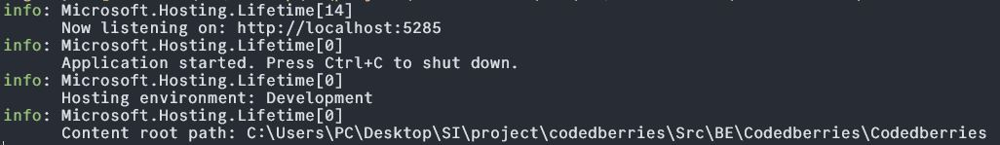
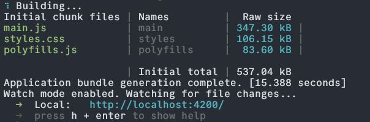
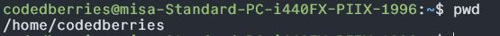
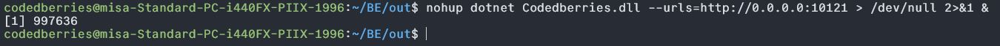
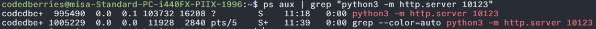

<h1>Sadržaj</h1>

- [Razvojna verzija](#razvojna-verzija)
    - [Instalacije](#instalacije)
    - [Pokretanje](#pokretanje)
- [Produkciona verzija](#produkciona-verzija)
    - [1. Pokretanje u aktivnom terminalu](#1-pokretanje-u-aktivnom-terminalu)
    - [2. Pokretanje u pozadini (komanda)](#2-pokretanje-u-pozadini-komanda)
      - [Zaustavljanje alata pokrenutog u pozadini](#zaustavljanje-alata-pokrenutog-u-pozadini)
- [Kredencijali svih tipova korisnika u sistemu](#kredencijali)
    

# Razvojna verzija

### Instalacije
Radi pokretanja web aplikacije neophodno je instalirati sledeće:    

**Node.js i npm** - Mogu se preuzeti sa [zvaničnog Node.js sajta](https://nodejs.org/en). Kako bi proverili da li je instaliran npm, menadžer paketa za Node.js, u terminalu ukucati komandu `npm` . Ukoliko se vrati greška da ova komanda ne postoji istu instalirati komandom u terminalu `npm install`. 

**Angular CLI** - Instalirati pomoću npm komande `npm install -g @angular/cli`.

**.NET Core SDK** - Preuzeti sa [sajta](https://dotnet.microsoft.com/en-us/download) i instalirati.

### Pokretanje

Klonirati repoziturijum aplikacije sa gitlaba sledećom komandom u terminalu: 
`git clone https://gitlab.pmf.kg.ac.rs/si2024/codedberries.git`

**Pokretanje backenda**
Folder iz koga je izvršeno kloniranje će sadržati kloniran repozitorijum pod nazivom *Codedberries*. Kako bi se pokrenuo backend aplikacije treba se locirati u terminalu na folder u kome je Program.cs sledećom komandom: 
`cd Codedberries/Src/BE/Codedberries/Codedberries`

Za pokretanje razvojne verzije otucati:
`git checkout dev`

Sa ove lokacije pokrenuti backend komandom:
`dotnet run`

Build aplikacije koji se dešava pri pozivu ove komande može malo potrajati. Kada bude gotov kao prvi od info odgovora trebalo bi
 da bude naznačeno na kom portu radi backend, kao što je to prikazano na slici ispod.

Radi pregleda endpointa razvijenih na bekendu, ovim načinom pokretanja se pokreće i *Swagger* za testiranje API-ja. Njemu se može pristupiti dodavanje */swagger* na adresu koju vrati `dotnet run` komanda, na gore navedenom primeru to bi bilo: *http://localhost:5285/swagger*.

**Pokretanje frontenda**
Otvoriti jos jedan terminal te se i u njemu locirati na folder u koji je kloniran repozitorijum. 
To možete jednostavno uraditi otvaranjem foldera u kome je repozitorijum upotrebom File explorer-a. Kada se nalazite u njemu, na desni klik trebalo bi da se otvori opcija  *Open in terminal*. Klikom na nju će se otvoriti terminal prozor sa odgovarajući radnim direktorijumom.
Pristupite angular-app folderu komandom:
`cd Codedberries/Src/FE/angular-app`

Za pokretanje razvojne verzije otucati:
`git checkout dev`

Kako bi se pokrenuo frontend otkucati komandu:
`ng serve`

Kao odgovor na ovu komandu, dobija se port na kome se nalazi aplikacija (podrazumevani port angular aplikacija 4200). Odgovor na navedenu komandu bi trebalo da izgleda ovako:
    

Ukoliko je i bekend prethodno uspešno pokrenut, otvaranjem adrese frontenda koja je dobijena bi trebalo da je alat uspešno pokrenut.

<!---------------------------------------------------------------------------------------------------------------------->

# Produkciona verzija

Za pokretanje produkcione verzije potrebno iz terminala web servera *softeng.pmf.kg.ac.rs* je locirati se u folder *codedberries*. Proveriti da li je to uspešno urađeno komanom `pwd` u terminalu web servera koja bi trebalo da vrati:

Dva korisna načina za pokretanje produkcione verzije su:

### 1. Pokretanje u aktivnom terminalu

Kada se alat pokrene na ovaj način, biće aktivan u trajanju sesije u terminalu.

**Bekend** - Locirati se u sledeći folder:`cd BE/out` i pokrenuti bekend komandom: `dotnet Codedberries.dll --urls=http://0.0.0.0:10122`.

**Frontend** - Pokrenuti još jedan terminal i locirati se na folder *codedberries* kako je gore navedeno. Locirati na folder: `cd FE/dist` i pokrenuti frontend komandom: `python3 error_script.py`.

Kada su frontend i bekend pokrenuti, otvoriti adresu: 
    
### 2. Pokretanje u pozadini (komanda)
Kada se alat pokrene na ovaj način, alat radi u pozadini odnosno ostaje aktivan i kada se zatvori terminal. 

**Bekend** - Locirati se u sledeći folder:`cd BE/out` i pokrenuti bekend komandom:
 `nohup dotnet Codedberries.dll --urls=http://0.0.0.0:10122  > /dev/null 2>&1 &`. 
 
 Odogovr na ovu komandu je pid procesa bekenda:
 

**Frontend** - Iz istog terminala se locirati se na folder *codedberries* kako je navedeno na početku. Locirati na folder: `cd FE/dist` i pokrenuti frontend komandom: 
`nohup python3  error_script.py > /dev/null 2>&1 &`.

Kao i kod bekenda dogovr na komandu je pid procesa frontenda.

#### Zaustavljanje alata pokrenutog u pozadini
Ukoliko se ne sačuvaju negde pidovi proces frontnda i bekenda do njih se može doći sledećim komandama:

**Bekend** - `ps aux | grep Codedberries.dll`. Dobije se:
 
 Bekend se zaustavlja  sa `kill <PID>` odnonso na ovom primeru `kill 997636`.

 **Frontend** - `ps aux | grep "python3 -m http.server 10123"
`. Dobije se:
 
 Frontend se zaustavlja sa `kill <PID>` odnonso na ovom primeru `kill 995490`.

# Kredencijali svih tipova korisnika u sistemu

**Super user** - username: petar.simic@gmail.com  password: password1
**Project owner**  - username: zoran.gajic@gmail.com  password: password3
**Project manager**  - username: lazar.milojevic@gmail.com  password: password3
**Employee**  - username: ana.dacic@gmail.com password: password3
**Viewer**  - username: mina.markovic@gmail.com password: password3

 Za oba načina pokretanja alat se otvara na adresi: *http://softeng.pmf.kg.ac.rs:10123*.
